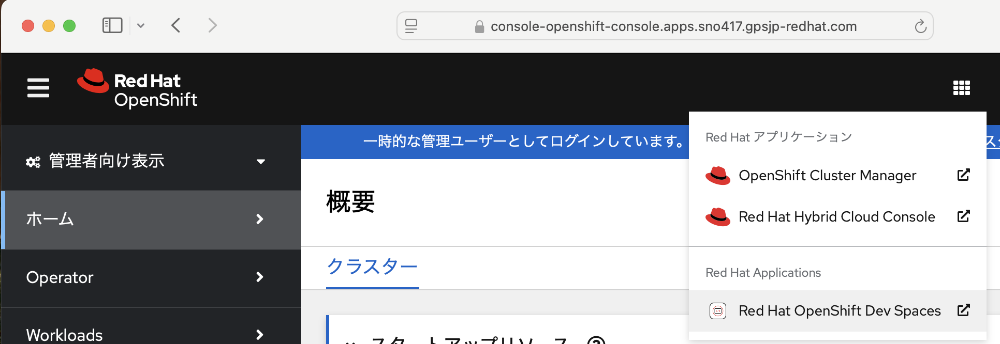

# ngl-python-fastapi-template

## 1. 事前準備(ローカル端末上での作業)

ContinueでGPT4oを利用するにはconfig.jsonで取得したGPT4oのapiKeyを設定する必要がある.
今回はOpenShiftのシークレット経由で渡す方針とする
config.jsonのサンプルをコピーし、取得したapiKeyで書き換えを行う.

```json
{
    "models": [
      {
        "model": "gpt-4o",
        "contextLength": 128000,
        "title": "GPT-4o",
        "systemMessage": "You are an expert software developer. You give helpful and concise responses.",
        "provider": "openai",
        "apiKey": "sk-proj-meZCQayxxxxxx"
      }
```

ocプロジェクト名であるche-kube-admin-devspaces-8h5s6rは適宜読み替えること  
作成したシークレットがDevSpacesで認識されるようにそのシークレット(シークレット名: continue-config-secret)に対してラベルを2つ付与する(mount-to-devworkspaceラベル & watch-secretラベル).　*1参照

```bash
# config.jsonのサンプルをコピー
cp -p continue.example/config.json .
# OpenAIのAPIキーを設定する, DevSpacesのワークスペースで/home/user/.continueにコピーして利用する
oc create secret generic continue-config-secret \
  --from-file=config.json=config.json \
  -n che-kube-admin-devspaces-8h5s6r
# 自動でマウントするために以下を実行
oc label secret continue-config-secret \
  controller.devfile.io/mount-to-devworkspace='true' \
  controller.devfile.io/watch-secret='true' \
  -n che-kube-admin-devspaces-8h5s6r
# 作成したシークレットの確認
  oc get secret continue-config-secret -o jsonpath='{.data.config\.json}' -n your-namespace | base64 --decodes
```

作成したシークレットを削除したい場合は以下を実行する

```bash
#oc delete secrets/continue-config-secret -n che-kube-admin-devspaces-8h5s6r
```

### GitHub以外のプライベートなGitリポジトリを利用する際の準備

プライベートなGitリポジトリを利用する場合は、なんらかの方法でその認証情報をDevSpaces側に認識させる必要がある.
今回はガイドにある、PAT(Personal Access Token)で伝搬させる方法を示す(*2).
or 今回はガイドにある、Secret経由で伝搬させる方法を示す.

PATを採用する理由は、個々人で該当のGitリポジトリからPAT取得できること,かつOpenShiftの操作(Secret)を可能な限り回避するためである.

PATの取得(GitLabの場合)


OpenShift Dev Spaces ダッシュボードの User Preferences ページで設定する


`https://<openshift_dev_spaces_fqdn>/dashboard/#/user-preferences?tab=personal-access-tokens`

例:
`https://devspaces.apps.sno417.gpsjp-redhat.com/dashboard/#/user-preferences?tab=personal-access-tokens`


##　2. DevSpaces上での実行

OpenShiftにログインしてDevSpacesを起動する.



Gitリポジトリ`https://github.com/ngl-sno/python-template.git`を指定してDevSpacesワークスペースを新規作成する


DevSpacesワークスペース起動時に以下のコマンドに相当する操作が自動で行われている.

```bash
# 仮想環境の作成
python -m venv /home/user/.venv
. /home/user/.venv/bin/activate
# pipインストール
pip install -r requirements.txt
```

実際にはこのGitリポジトリ直下の`devfile.yaml`というファイルに定義されている.
このサンプルはFast API用に作成しているのでDjangoに置き換える場合はコマンドを適宜読み替えること.

```
commands:
  - id: setup-venv
    exec:
      component: python
      workingDir: ${PROJECTS_ROOT}/python-template
      commandLine: "python -m venv /home/user/.venv && . /home/user/.venv/bin/activate && pip install -r requirements.txt"
```

### devfile.yamlとは?

Red Hat Devspacesが利用する「devfile.yaml」は、開発環境を定義するためのYAML形式の設定ファイルである.

* 開発に必要なコンテナ（ランタイム・ツールなど）やプロジェクト情報、コマンド実行方法などを記述し、自動セットアップにより各開発者で同じ開発環境を再現できる.
* Devfileはオープンソース仕様として定義されており、Red Hat Devspacesだけでなく他のツールでも共通フォーマットとして利用できる.

Devfileの公式仕様は、以下のリンクから参照できる.Devfileの概要、仕様、使用方法などが確認できる.

`https://devfile.io/`

今のところは自分でTask Runしないとconfig.jsonを上書きできない
左上のハンバーガーメニューをクリックしてRun taskを選択する(copyconfigというカスタムのタスクを定義している)


devfileを選択する.


copyConfigを選択する.この操作により/etc/secretフォルダ配下にマウントされたシークレット(config.json)が/home/user/.continue配下へコピーされる.


参考)以下のコマンドで自動でDevSpacesワークスペースにマウントされたシークレットの中身を確認できる.

```bash
ls /etc/secret/continue-config-secret/config.json
```

Run taskすると以下の操作に相当するコマンドが実行される.

```bash
cp -p /etc/secret/continue-config-secret/.config.json /projects/.
```

Continueで、GPT 4oをモデルとして選択する.


### Fast APIの起動.

devfile.yamlに定義された`Start FastAPI server`を実行する.

ターミナルで以下を実行しても構わない.
```bash
uvicorn server:app --reload
```

## ローカル端末から動作確認

実施に起動したFast APIへローカル端末のブラウザから接続して`"Hello, World!`と記載されたjsonを表示してみる.

OIDCなどの認証の仕組みを組み込んでいないので,
oc port-forwardという仕組みでsshのポートフォワードのような経路を確立して接続を行う.

以下のコマンドの前提:  
ローカル端末がOpenShiftにログイン済みであること

```bash
#Pod名の確認およびポートフォワードによるPodへの接続
oc project [ocプロジェクト名]
oc get pod 
oc port-forward pod/[Pod名] 8000:8000

#実行例
oc project che-kube-admin-devspaces-8h5s6r
oc port-forward pod/workspace1a9f3febcb89414d-6986d5b994-mc25h 8000:8000
```

別ターミナルで以下を実行する,  もしくはブラウザで`http://localhost:8000`を開く

```bash
curl http://localhost:8000
```


## 現在の制約

今のところ以下のマニュアル操作を実施しないとcontine用のconfig.jsonを上書きできない  
devfile.yamlで定義したcopyconfigをTask Runする  
自身のOCプロジェクトに作成したシークレット`continue-config-secret`で/home/user/.continue/config.jsonを上書きする  操作が定義されている

## 参考

*1 シークレットのマウント
https://docs.redhat.com/ja/documentation/red_hat_openshift_dev_spaces/3.18/html/user_guide/using-credentials-and-configurations-in-workspaces#mounting-secrets

*2 Git プロバイダーアクセストークンの使用  
https://docs.redhat.com/ja/documentation/red_hat_openshift_dev_spaces/3.18/html/user_guide/using-credentials-and-configurations-in-workspaces#using-a-git-provider-access-token

https://chatgpt.com/share/67aa542f-dd0c-8013-a9dd-5510927e651c

